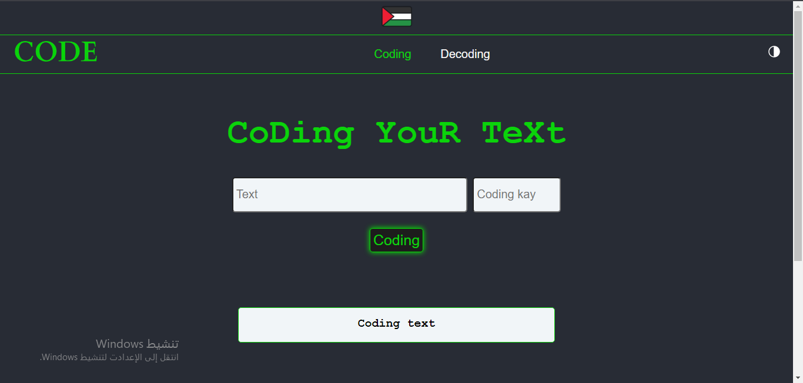
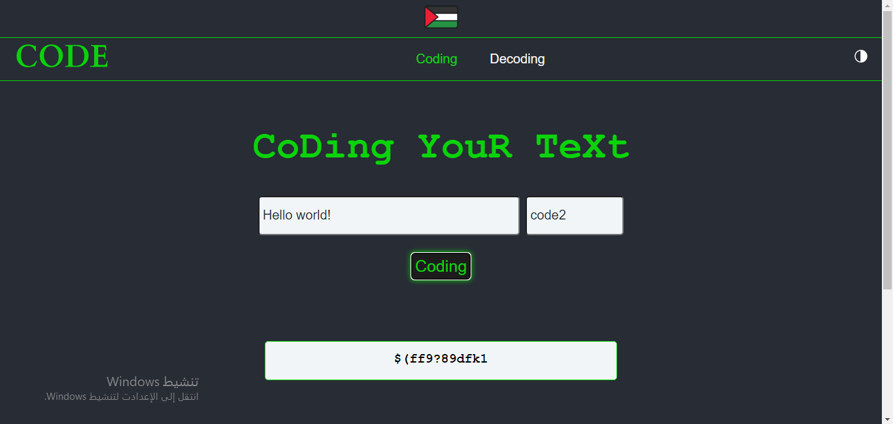
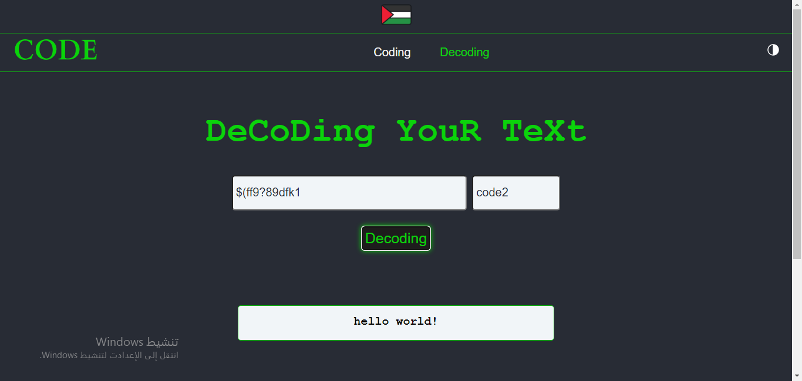

# Encryption-Web-App



    


Introduction
------------

### Description:
A simple web interface for text encryption using HTML, CSS, and JavaScript. This project allows users to input text and encrypt it using a specific algorithm to obtain the encrypted text.


### Features:
- Encrypt text using a simple algorithm.  
- Simple and user-friendly interface.
- Ability to easily re-encrypt and decrypt text.


### Installation:

To run the project locally, follow these steps:

1. Clone the repository to your local machine using the following command:  
    ```bash
    git clone https://github.com/Wesam-1110111/Encryption-Web-App.git
    ```
3. Open the cloned folder on your local machine.
4. Open the `index.html` file in your browser to start using the interface.

### Try it now:

You can run it now on GitHub pages. [run](https://wesam-1110111.github.io/Encryption-Web-App/index.html)

### Usage:
1. Enter the text you wish to encrypt *Text* input field.
2. Enter coding kay that you want to use *coding kay* input field.
    - **Coding kays: for EN: [code0, code2, code3], for AR: [acode1]**
    
3. To decrypt go to `decoding.html` in Navbar.
    

### Contributing:
Contributions are welcome! If you'd like to participate, you can open an Issue or submit a Pull Request.


### License:
This project is licensed under the MIT License.


### Contact:
For any questions or suggestions, feel free to reach out via [Telegram](https://t.me/Mr_w_23),   
or you can follow me on [X-twitter](https://twitter.com/Wesam2021ly?t=T7-5R2s8xv2HnPtTTj8pvw&s=09).
